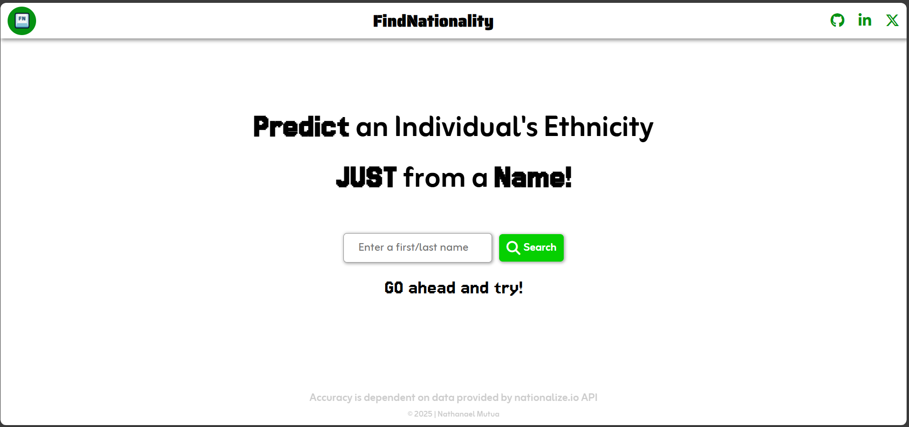
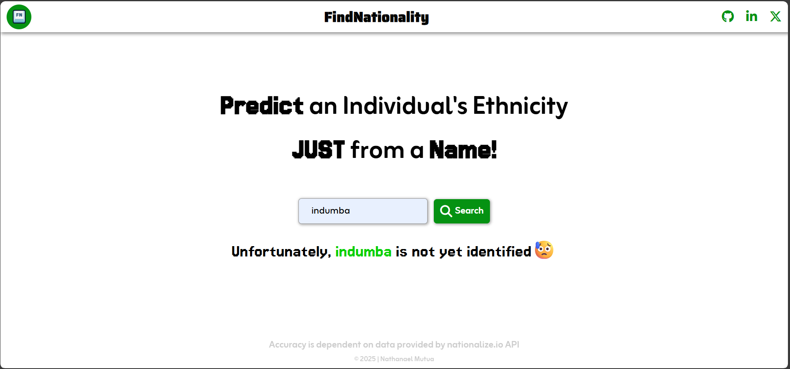
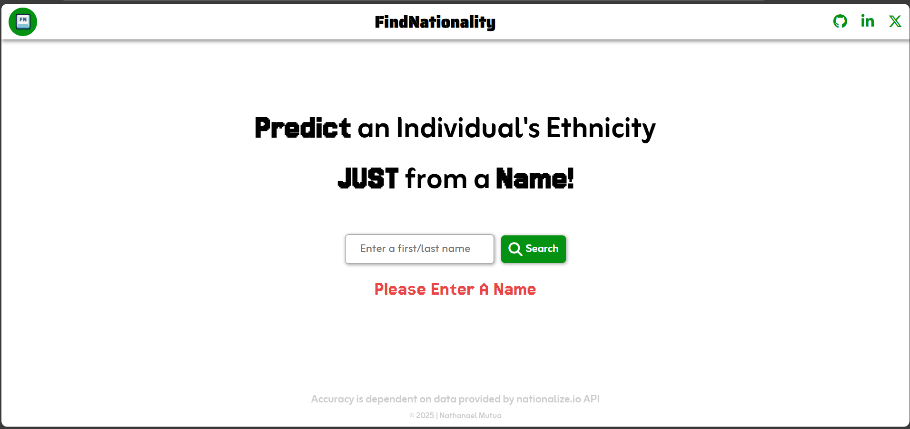
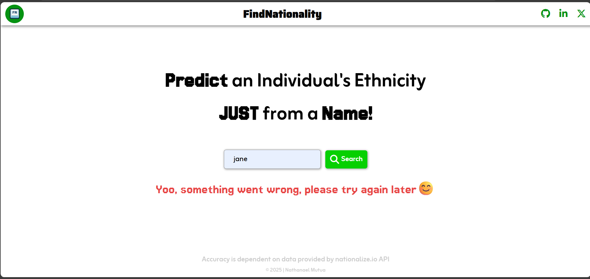

# NATIONALITY GENERATOR

Discover origins and embrace diversity with every name.

Built with these tools and technologies:

- HTML
- CSS
- JavaScript
- JSON
- npm
- prettier
- Vite

---

## Table of Contents

- [Overview](#overview)
- [Getting Started](#getting-started)
   - [Prerequisites](#prerequisites)
   - [Installation](#installation)
- [Expected Output](#expected-output)

## Overview

I developed a simple tool to exercise using APIs, carrying out API requests and manipulating data.

The tool predicts an individual's nationality solely on their name, its accuracy is dependent on the API, [nationalize.io](https://nationalize.io/documentation).

## Getting started

### Prerequisites

This project requires the following dependencies:

- Package manager: [Node.js](https://nodejs.org/en/download)
  > Download this from your browser
  > -Programming languages: HTML, CSS and JavaScript

### Installation

1. Clone the repository

   ```bash
   git clone https://github.com/NathanaelMutua/nationality-generator.git
   ```

2. Runing the project
   ```bash
   npm run dev
   ```

## Expected Output

1. When you run an unidentified name:
   

2. When you search for an empty string:
   

3. When the fetch is unable - (Tested using throttling offline)
   